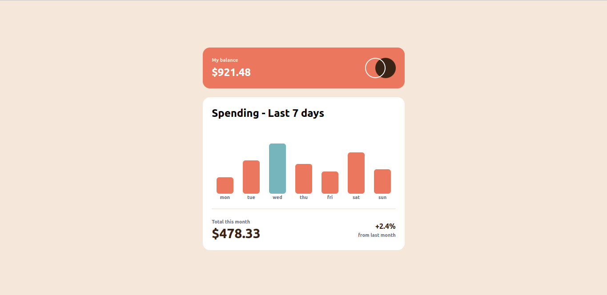
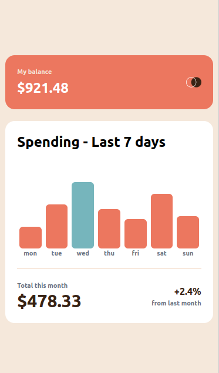

# Frontend Mentor - Expenses chart component solution

This is a solution to the [Expenses chart component challenge on Frontend Mentor](https://www.frontendmentor.io/challenges/expenses-chart-component-e7yJBUdjwt). Frontend Mentor challenges help you improve your coding skills by building realistic projects.

## Table of contents

- [Overview](#overview)
  - [The challenge](#the-challenge)
  - [Screenshot](#screenshot)
  - [Links](#links)
- [My process](#my-process)
  - [Built with](#built-with)
  - [Support](#Support)
- [Author](#author)

## Overview

### The challenge
Create Expenses chart component to look similar to the design in the [design](design/) folder

Users should be able to:
- View the bar chart and hover over the individual bars to see the correct amounts for each day
- See the current day’s bar highlighted in a different colour to the other bars
- View the optimal layout for the content depending on their device’s screen size
- See hover states for all interactive elements on the page

### Screenshot

#### For Desktop

#### For Mobile

### Links

- Live Site URL: [Click here](https://asumvictor.github.io/expenses-chart/)

## My process

### Built with

- Semantic HTML5 markup
- Javascript
- Tailwind CSS
- CSS custom properties
- Flexbox
- CSS Grid

## Support
Compare the picture in the [design](design/) folder and [screenshot](screenshot/). If you like it give me a ⭐⭐⭐⭐⭐⭐

## Author

- Website - [My Portfolio](https://asumvictor.github.io/Portfolio/)
- Frontend Mentor - [@AsumVictor](https://www.frontendmentor.io/profile/Asumvictor-dev)
- Twitter - [iamasum369](https://twitter.com/iamasum369)

